---
## Front matter
title: "Отчёт по лабораторной работе №1"
subtitle: "По теме: Установка и конфигурация операционной системы на виртуальную машину"
author: "Выполнил: Чубаев Кирилл Евгеньевич, НММбд-01-24"

## Generic otions
lang: ru-RU
toc-title: "Содержание"

## Bibliography
bibliography: bib/cite.bib
csl: pandoc/csl/gost-r-7-0-5-2008-numeric.csl

## Pdf output format
toc: true # Table of contents
toc-depth: 2
lof: true # List of figures
lot: true # List of tables
fontsize: 12pt
linestretch: 1.5
papersize: a4
documentclass: scrreprt
## I18n polyglossia
polyglossia-lang:
  name: russian
  options:
  - spelling=modern
  - babelshorthands=true
polyglossia-otherlangs:
  name: english
## I18n babel
babel-lang: russian
babel-otherlangs: english
## Fonts
mainfont: PT Serif
romanfont: PT Serif
sansfont: PT Sans
monofont: PT Mono
mainfontoptions: Ligatures=TeX
romanfontoptions: Ligatures=TeX
sansfontoptions: Ligatures=TeX,Scale=MatchLowercase
monofontoptions: Scale=MatchLowercase,Scale=0.9
## Biblatex
biblatex: false
biblio-style: "gost-numeric"
biblatexoptions:
  - parentracker=true
  - backend=biber
  - hyperref=auto
  - language=auto
  - autolang=other*
  - citestyle=gost-numeric
## Pandoc-crossref LaTeX customization
figureTitle: "Рис."
tableTitle: "Таблица"
listingTitle: "Листинг"
lofTitle: "Список иллюстраций"
lotTitle: "Список таблиц"
lolTitle: "Листинги"
## Misc options
indent: true
header-includes:
  - \usepackage{indentfirst}
  - \usepackage{float} # keep figures where there are in the text
  - \floatplacement{figure}{H} # keep figures where there are in the text
---

# Цель работы

Целью данной работы является приобретение практических навыков установки операционной системы на виртуальную машину, настройки минимально необходимых для дальнейшей работы сервисов.

# Ход выполнения лабораторной работы

1. Я установил VirtualBox в качестве виртуальной машины для ОС Linux, а также файл с дистрибутивом Fedora в формате ".iso".

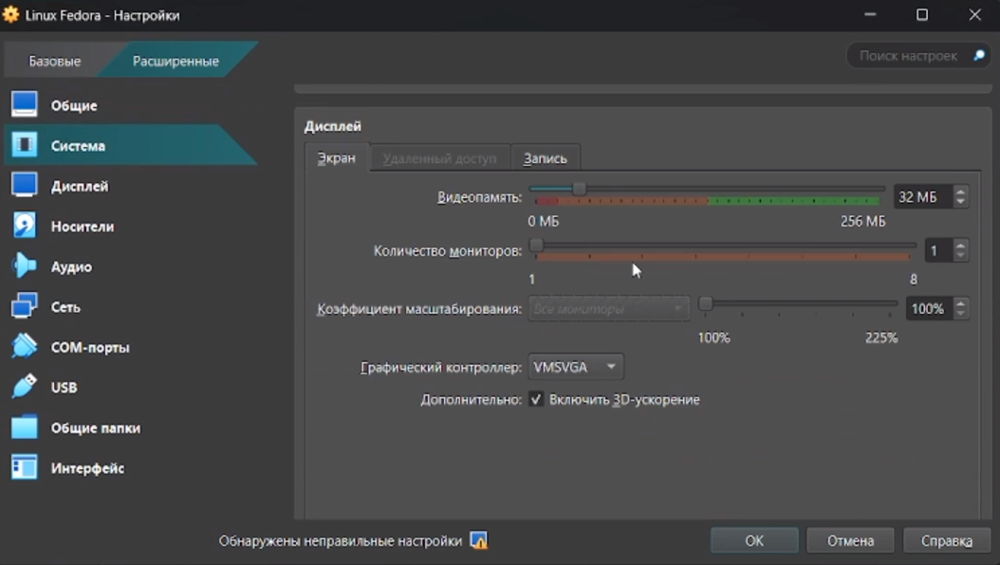

2. Далее я начал задавать настройки для виртуальной машины. Я создал виртуальный диск, выделил 80 ГБ памяти, 6 ГБ ОЗУ, включил 3D ускоритель, поставил графический контроллер VMSVGA:

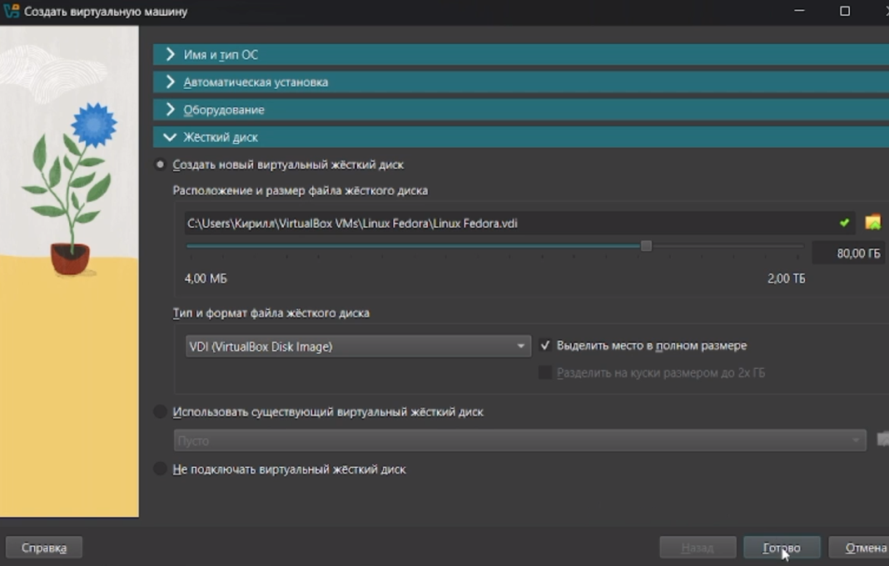

3. Дистрибутив Fedora запустился, я создал аккаунт и я настроил ее для своего удобства: увеличил разрешение экрана, добавил русскую раскладку:

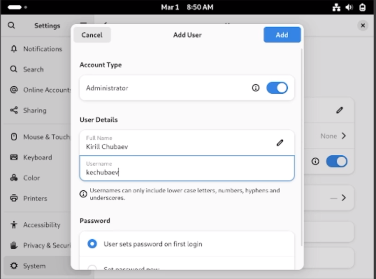
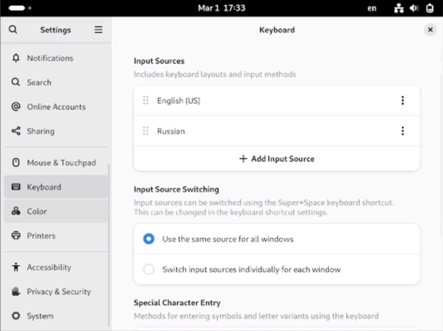
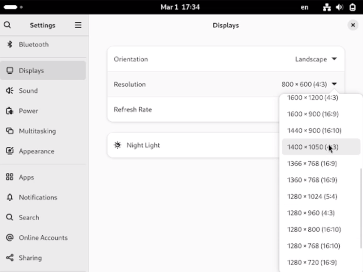

4. Далее я включил режим суперпользователя:

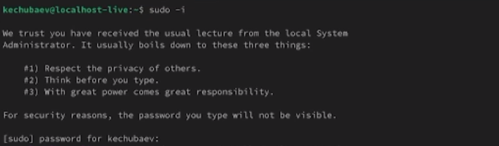

5. Затем установил средства разработки:

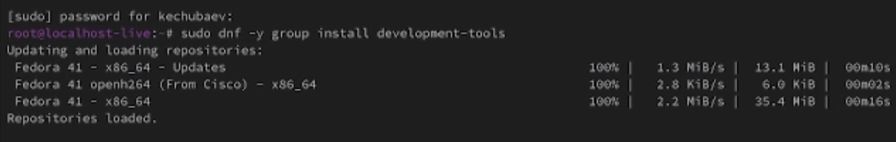
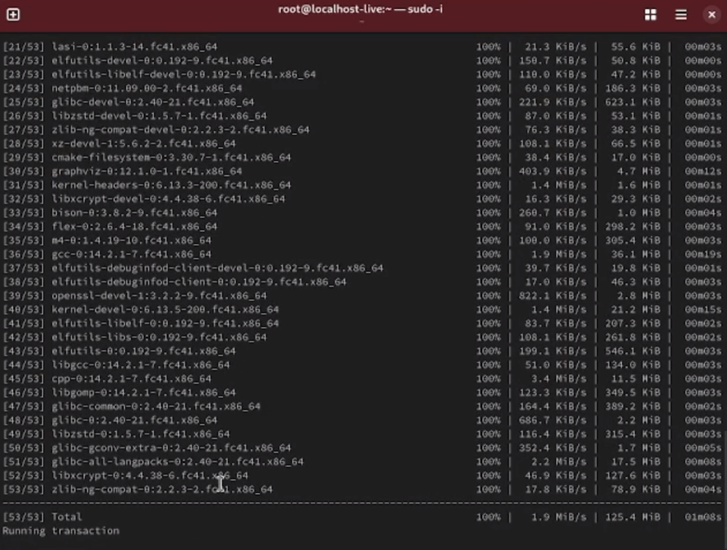

6. Потом обновил все пакеты:

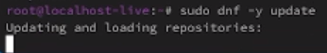

7. Далее я написал программу для удобства консоли: 

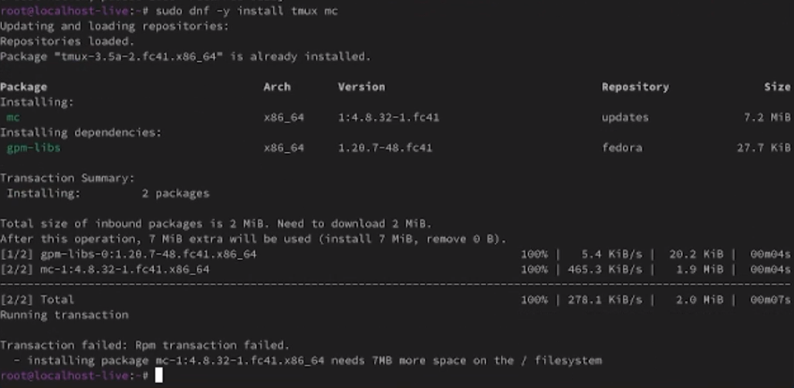

8. Затем я отключил систему безопасности SELinux и перезапустил систему:

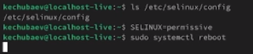

9. Далее я установил pandoc и pandoc-crossref и поместил их в папку "/usr/local/bin". А затем установил пакеты TexLive

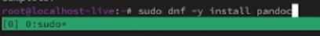
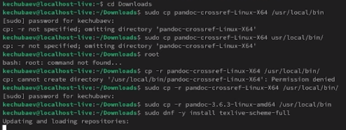
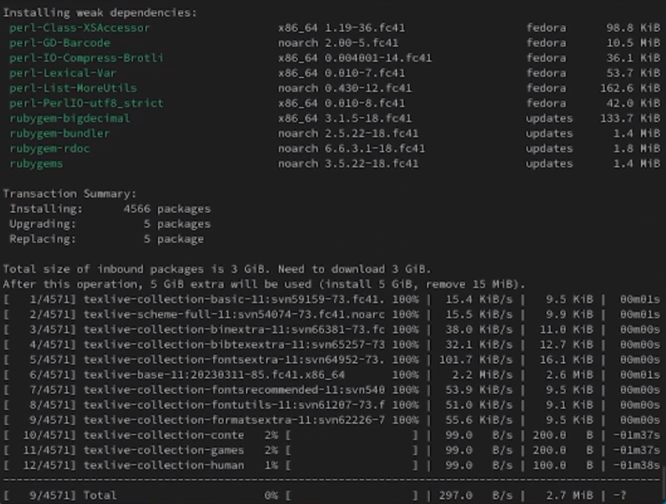

# Вывод

В ходе выполнения данной лабораторной работы я приобрел практические навыки установки операционной системы Linux Fedora на виртуальную машину Virtual, а также настройки минимально необходимых для дальнейшей работы сервисов.

# Контрольные вопросы 

1. Учётная запись пользователя в Linux содержит следующую информацию:

1) Имя пользователя. Это имя, которое вводит пользователь в ответ на приглашение login.

2) Идентификатор пользователя (UID). Это положительное целое число, по которому система отслеживает пользователей.  
Идентификатор группы (GID). Группы пользователей применяются для организации доступа нескольких пользователей к некоторым ресурсам.  

3) Полное имя. Помимо системного имени в учётной записи содержится и полное имя (имя и фамилия) использующего данную учётную запись человека. 

4) Домашний каталог. У каждого пользователя есть собственный домашний каталог, в котором он может хранить свои данные.  

5) Начальная оболочка. В учётной записи указано, какую из командных оболочек нужно запустить для данного пользователя. Если специально не указывать начальную оболочку при создании учётной записи, она будет назначена по умолчанию.  
Вся информация о пользователе обычно хранится в файлах /etc/passwd и /etc/group. 

3. Файловая система — это порядок, определяющий способ организации, хранения и именования данных на носителях информации в компьютерах, а также в другом электронном оборудовании: цифровых фотоаппаратах, мобильных телефонах и т. п.

Примеры файловых систем с краткой характеристикой:

1) NTFS (New Technology File System). Фирменная файловая система Microsoft, которую разработчики начали внедрять в операционную систему Windows, начиная с версии NT 3.1. Поддерживает большие файлы, разграничение доступа к файлам и другие продвинутые функции. 

2) HFS+ (Hierarchical File System Plus). Популярная файловая система для операционных систем macOS.  

3) Extended Filesystem (Ext3, Ext4). Используется в Linux.  
Файловая система определяет предельный размер файлов, которые можно хранить на носителе, размер самого диска, дополнительные сведения о каждом файле, доступные для записи, возможность версионирования каждого файла, способы восстановления файла, если его случайно удалят, скорость чтения и записи данных на диск

4. Окончательный список смонтированных файловых систем находится в каталоге /proc/mounts.

5. Чтобы удалить зависший процесс в Linux, можно использовать следующие методы:

1) Команда kill. Позволяет завершить процесс по его идентификационному номеру (PID). PID можно узнать с помощью команды 

ps aux | grep [имя процесса]

2) Команда killall. Завершает все процессы с заданным именем или группы процессов с частично совпадающими именами. Синтаксис похож на команду kill, однако для её использования необязательно знать PID. Вместо этого нужно ввести наименование процесса. 

Например, чтобы принудительно закрыть несколько окон браузера Firefox, нужно ввести команду

killall -9 firefox
 
3) Команда xkill. Простой способ завершить зависший процесс, который не реагирует на другие методы. Для этого нужно нажать Alt+F2 и ввести xkill

Курсор мыши превратится в крестик. Навести крестик на окно зависшего приложения и нажать левую кнопку мыши. 

# Дополнительное задание 

Я получил следующую информацию с помощью команды dmesg:

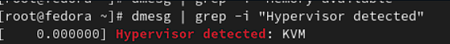
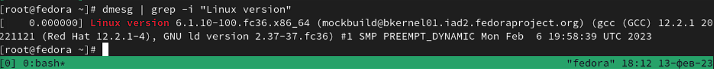
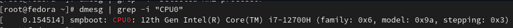

# Список литературы

1. Dash, P. Getting Started with Oracle VM VirtualBox / P. Dash. – Packt Publishing Ltd, 2013. – 86 сс.

2. Colvin, H. VirtualBox: An Ultimate Guide Book on Virtualization with VirtualBox. VirtualBox / H. Colvin. – CreateSpace Independent Publishing Platform, 2015. – 70 сс.

3. Vugt, S. van. Red Hat RHCSA/RHCE 7 cert guide : Red Hat Enterprise Linux 7 (EX200 and EX300) : Certification Guide. Red Hat RHCSA/RHCE 7 cert guide / S. van Vugt. – Pearson IT Certification, 2016. – 1008 сс.

4. Робачевский, А. Операционная система UNIX / А. Робачевский, С. Немнюгин, О. Стесик. – 2-е изд. – Санкт-Петербург : БХВ-Петербург, 2010. – 656 сс.

5. Немет, Э. Unix и Linux: руководство системного администратора. Unix и Linux / Э. Немет, Г. Снайдер, Т.Р. Хейн, Б. Уэйли. – 4-е изд. – Вильямс, 2014. – 1312 сс.

6. Колисниченко, Д.Н. Самоучитель системного администратора Linux : Системный администратор / Д.Н. Колисниченко. – Санкт-Петербург : БХВ-Петербург, 2011. – 544 сс.

7. Robbins, A. Bash Pocket Reference / A. Robbins. – O’Reilly Media, 2016. – 156 сс.7. 
