---
## Front matter
title: "Отчёт по лабораторной работе №2"
subtitle: "По теме: Первоначальная настройка git"
author: "Выполнил: Чубаев Кирилл Евгеньевич, НММбд-01-24"

## Generic otions
lang: ru-RU
toc-title: "Содержание"

## Bibliography
bibliography: bib/cite.bib
csl: pandoc/csl/gost-r-7-0-5-2008-numeric.csl

## Pdf output format
toc: true # Table of contents
toc-depth: 2
lof: true # List of figures
lot: true # List of tables
fontsize: 12pt
linestretch: 1.5
papersize: a4
documentclass: scrreprt
## I18n polyglossia
polyglossia-lang:
  name: russian
  options:
  - spelling=modern
  - babelshorthands=true
polyglossia-otherlangs:
  name: english
## I18n babel
babel-lang: russian
babel-otherlangs: english
## Fonts
mainfont: PT Serif
romanfont: PT Serif
sansfont: PT Sans
monofont: PT Mono
mainfontoptions: Ligatures=TeX
romanfontoptions: Ligatures=TeX
sansfontoptions: Ligatures=TeX,Scale=MatchLowercase
monofontoptions: Scale=MatchLowercase,Scale=0.9
## Biblatex
biblatex: false
biblio-style: "gost-numeric"
biblatexoptions:
  - parentracker=true
  - backend=biber
  - hyperref=auto
  - language=auto
  - autolang=other*
  - citestyle=gost-numeric
## Pandoc-crossref LaTeX customization
figureTitle: "Рис."
tableTitle: "Таблица"
listingTitle: "Листинг"
lofTitle: "Список иллюстраций"
lotTitle: "Список таблиц"
lolTitle: "Листинги"
## Misc options
indent: true
header-includes:
  - \usepackage{indentfirst}
  - \usepackage{float} # keep figures where there are in the text
  - \floatplacement{figure}{H} # keep figures where there are in the text
---

# Цель работы

Целью данной работы является:
1. Изучить идеологию и применение средств контроля версий;

2. Освоить умения по работе с git.

# Ход выполнения лабораторной работы

1. Я открыл терминал и указал имя и email владельца репозитория:

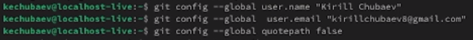

2. Далее настроил utf-8 в выводе сообщений git и задал имя начальной ветки, а также ввёл параметр «autocrlf:» и параметр «safecrlf:»:

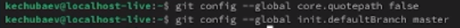

3. Я сгенерировал пару ключей, которые сохранились в каталоге ~/.ssh/. Далее загрузил сгенерированный открытый ключ на GitHub:

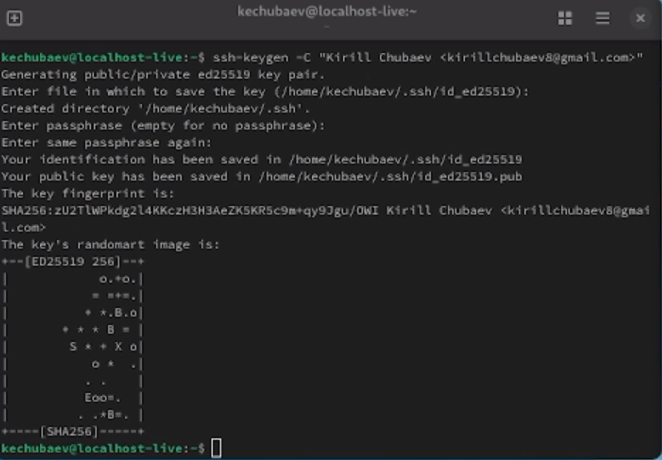
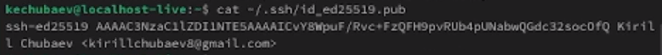

4. Далее я сгенерировал PGP-ключ и указал ему соответсвующие настройки

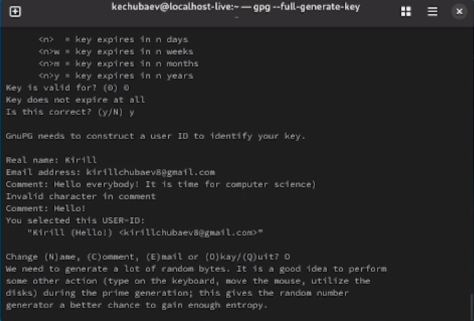

5. Затем я вывел отпечаток данного ключа и загрузил на GitHub:
 
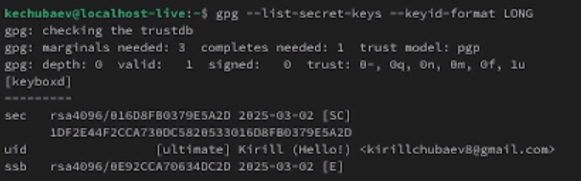
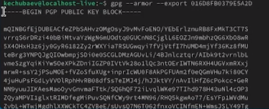
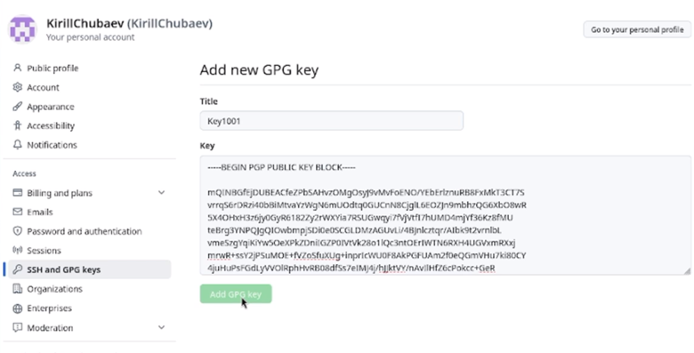

6. Потом указал Git применять ключ при подписи коммитов:

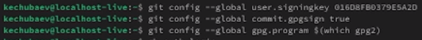

7. Перейдя на станицу репозитория с шаблоном курса, я начал создавать репозиторий через сайт GitHub. Я выбрал вкладку «Use this template» и в открывшемся окне я задал имя репозитория «study_2024-2025» и создал сам репозиторий:

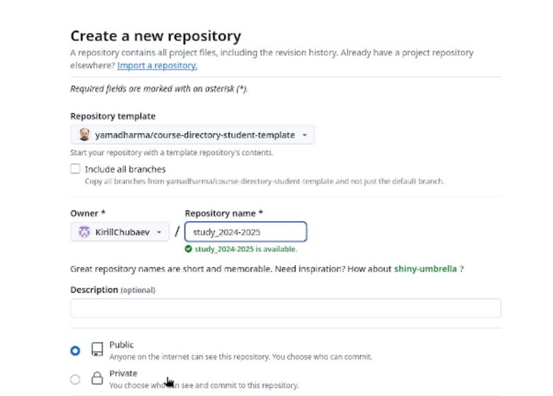

8. Затем я клонировал репозиторий с помощью специальной команды:

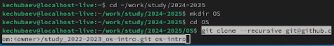
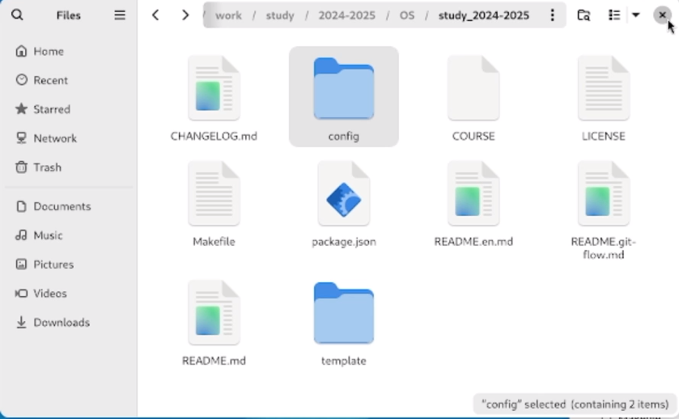

9. Далее я удалил ненужные файлы и с помощью команды make создал дополнительные каталоги:

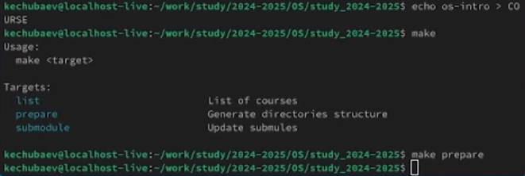

10. И загрузил их на GitHub:

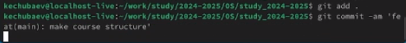
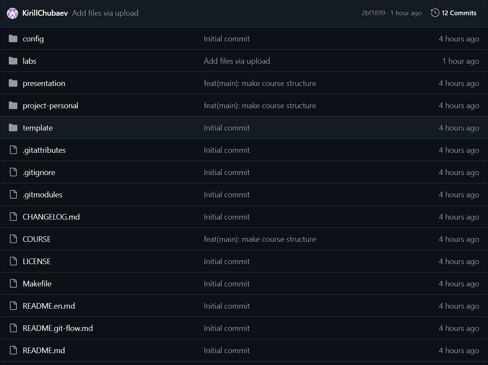

# Вывод

В ходе выполнения данной лабораторной работы я изучл идеологию и применение средств контроля версий, а также освоил умения по работе с git.