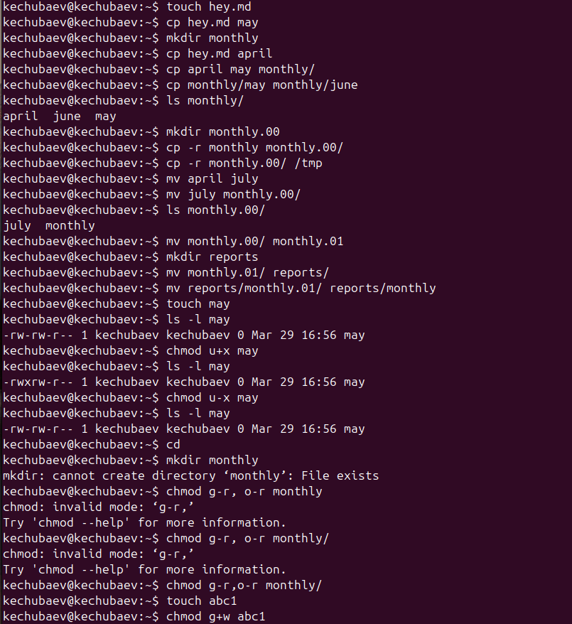
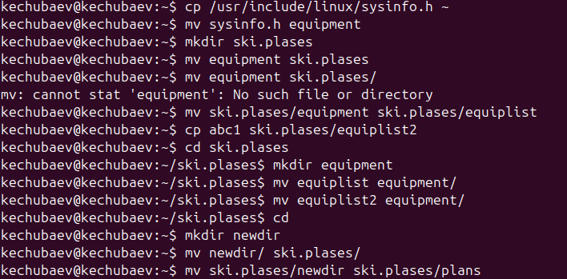
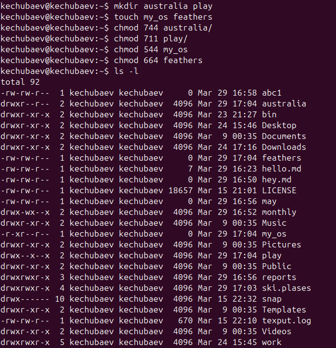
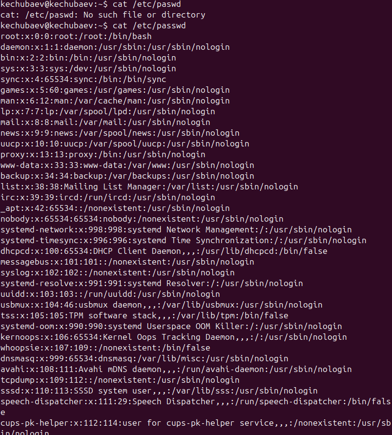
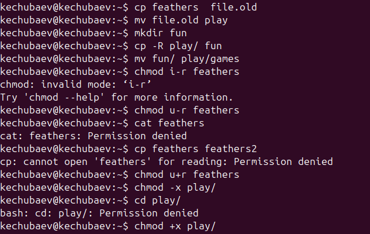
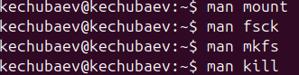

---
## Front matter
title: "Отчёт по лабораторной работе №6"
subtitle: "По теме: Основы интерфейса взаимодействия пользователя с системой Unix на уровне командной строки"
author: "Выполнил: Чубаев Кирилл Евгеньевич, НММбд-01-24"

## Generic otions
lang: ru-RU
toc-title: "Содержание"

## Bibliography
bibliography: bib/cite.bib
csl: pandoc/csl/gost-r-7-0-5-2008-numeric.csl

## Pdf output format
toc: true # Table of contents
toc-depth: 2
lof: true # List of figures
lot: true # List of tables
fontsize: 12pt
linestretch: 1.5
papersize: a4
documentclass: scrreprt
## I18n polyglossia
polyglossia-lang:
  name: russian
  options:
	- spelling=modern
	- babelshorthands=true
polyglossia-otherlangs:
  name: english
## I18n babel
babel-lang: russian
babel-otherlangs: english
## Fonts
mainfont: IBM Plex Serif
romanfont: IBM Plex Serif
sansfont: IBM Plex Sans
monofont: IBM Plex Mono
mathfont: STIX Two Math
mainfontoptions: Ligatures=Common,Ligatures=TeX,Scale=0.94
romanfontoptions: Ligatures=Common,Ligatures=TeX,Scale=0.94
sansfontoptions: Ligatures=Common,Ligatures=TeX,Scale=MatchLowercase,Scale=0.94
monofontoptions: Scale=MatchLowercase,Scale=0.94,FakeStretch=0.9
mathfontoptions:
## Biblatex
biblatex: true
biblio-style: "gost-numeric"
biblatexoptions:
  - parentracker=true
  - backend=biber
  - hyperref=auto
  - language=auto
  - autolang=other*
  - citestyle=gost-numeric
## Pandoc-crossref LaTeX customization
figureTitle: "Рис."
tableTitle: "Таблица"
listingTitle: "Листинг"
lofTitle: "Список иллюстраций"
lotTitle: "Список таблиц"
lolTitle: "Листинги"
## Misc options
indent: true
header-includes:
  - \usepackage{indentfirst}
  - \usepackage{float} # keep figures where there are in the text
  - \floatplacement{figure}{H} # keep figures where there are in the text
---

# Цель работы

Целью данной лабораторной работы является приобретение практических навыков взаимодействия пользователя с системой посредством командной строки.

# Теоретические сведения

В операционной системе типа Linux взаимодействие пользователя с системой обычно
осуществляется с помощью командной строки посредством построчного ввода команд. 
При этом обычно используется командные интерпретаторы языка shell: ```/bin/sh; /bin/csh; /bin/ksh.```

Командой в операционной системе называется записанный по
специальным правилам текст (возможно с аргументами), 
представляющий собой указание на выполнение какой-либо 
функций (или действий) в операционной системе.
Обычно первым словом идёт имя команды, остальной текст — аргументы или опции,
конкретизирующие действие.

* Команда man используется для просмотра (оперативная помощь) в диалоговом режиме руководства (manual) по основным командам операционной системы типа Linux.

* Команда cd. Команда cd используется для перемещения по файловой системе операционной системы типа Linux.

* Команда pwd. Для определения абсолютного пути к текущему каталогу используется команда pwd (print working directory).

* Команда ls. Команда ls используется для просмотра содержимого каталога.

* Команда mkdir. Команда mkdir используется для создания каталогов.

* Команда rm. Команда rm используется для удаления файлов и/или каталогов.

# Выполнение лабораторной работы

1. Я определил полное имя нашего домашнего каталога. При помощи команды cd я перешел в домашний каталог и увидел, что его название совпадает с моим именем. Путь к моему домашнему каталогу показала команда pwd:

{ #fig:001 width=70% }

2. Далее я перешел в каталог /tmp, при помощи команды cd /tmp:

3. Потом я вывел на экран содержимое каталога /tmp. Для этого использовал команду ls с различными опциями:

{ #fig:002 width=70% }

{ #fig:003 width=70% }

4. Затем я определил, есть ли в каталоге /var/spool подкаталог с именем cron. Да, он там оказался
{ #fig:006 width=70% }

5. Перешел в домашний каталог и вывел на экран его содержимое. Определил, кто является владельцами файлов и подкаталогов посредством команды ls -al. Большинство файлов принадлежат моему пользователю и root.

6. В домашнем каталоге я создал новый каталог с именем newdir при помощи команды mkdir. В каталоге ~/newdir создал новый каталог с именем morefun:

{ #fig:006 width=70% }

7. В домашнем каталоге я создал три новых каталога с именами letters, memos, misk, и затем удалил эти каталоги одной командой с помощью rm -r:

{ #fig:006 width=70% }

8. В задании предполагается, что каталог /newdir не получится удалить командой rm. Для этого сначала надо очистить каталог /newdir от подкаталога morefun. Но если использовать ключ -r к команде rm то тогда все удалится, не обращая внимания на подкаталоги.

{ #fig:008 width=70% }

9. С помощью команды man я определил, какую опцию команды ls нужно использовать для просмотра содержимое не только указанного каталога, но и подкаталогов, входящих в него. Введя в консоли man ls Мы получим справку на английском языке и в ней нужный нам ключ к команде. Это ключ -R

10. Также с помощью команды man определим набор опций команды ls, позволяющий отсортировать по времени последнего изменения выводимый список содержимого каталога с развёрнутым описанием файлов. Введя в консоли man ls  Я получил справку на английском языке и в ней нужный мне ключ к команде. Это ключ -t.

11. Потом я использовал команду man для просмотра описания разных команд.

12. Используя информацию, полученную при помощи команды history, выполним модификацию и исполнение нескольких команд из буфера команд.

{ #fig:015 width=70% }
{ #fig:015 width=70% }

# Вывод

В ходе данной лабораторной работы я приобрел практические навыки взаимодействия пользователя с системой посредством командной строки.

# Контрольные вопросы

1.	Что такое командная строка?
Ответ: текстовый интерфейс взаимодействия пользователя с системой

2.	При помощи какой команды можно определить абсолютный путь текущего каталога? Приведите пример.
Ответ: команда pwd, пример:
-	cd /var/www
-	pwd
-	/var/www/

3.	При помощи какой команды и каких опций можно определить только тип файлов и их имена в текущем каталоге? Приведите примеры.
Ответ: команда ls с опцией -F.

4.	Какие файлы считаются скрытыми? Как получить информацию о скрытых файлах? Приведите примеры.
Ответ: Некоторые файлы в операционной системе скрыты от просмотра и обычно используются для настройки рабочей среды. Имена таких файлов начинаются с точки. информацию о них можно получить с помощью команды ls с опцией -a.

5.	При помощи каких команд можно удалить файл и каталог? Можно ли это сделать одной и той же командой?
Ответ: С помощью команды rm можно удалить как отдельный файл так и целый каталог, в случае каталога необходимо указать опцию -r.

6.	Как определить, какие команды выполнил пользователь в сеансе работы? Ответ: с помощью команды history.

7.	Каким образом можно исправить и запустить на выполнение команду, которую пользователь уже использовал в сеансе работы? Приведите примеры Ответ: узнать порядковый номер этой команды с помощью history
затем изменить её сл. образом:
!<номер_команды>:s/<что_меняем>/<на_что_меняем>

8.	Можно ли в одной строке записать несколько команд? Если да, то как? Приведите примеры 

Ответ: да, можно, необходимо разделить команды символом точки с запятой в таком случае они будут выполняться последовательно в том порядке, в котором они записаны пример: cd /tmp/; ls -l;pwd

9.	Что такое символ экранирования? Приведите примеры использования этого символа.
Ответ: символ экранирования \ (обратный слэш) - символ, экранирующие управляющие конструкции и символы в названии файлов и папок Пример: ls /etc/nginx

10.	Какая информация выводится на экран о файлах и каталогах, если используется опция l в команде ls?
Ответ: тип файла, право доступа, число ссылок, владелец, размер, дата последней ревизии, имя файла или каталога.

11.	Что такое относительный путь к файлу? Приведите примеры использования относительного и абсолютного пути при выполнении какой-либо команды. 
Ответ: относительный путь - путь к тому или иному файлу или директории относительной текущей рабочей директории, пример:
папка /www/ в директории /var/ абсолютный путь: /var/www/
относительный путь(если рабочая директория - /var/): /www/

12.	Как получить информацию об интересующей вас команде?
Ответ: можно попробовать найти информацию по использованию с помощью утилиты man, или попробовать ввести опцию --help.

13.	Какая клавиша или комбинация клавиш служит для автоматического дополнения вводимых команд?
Ответ: клавиша Tab.
